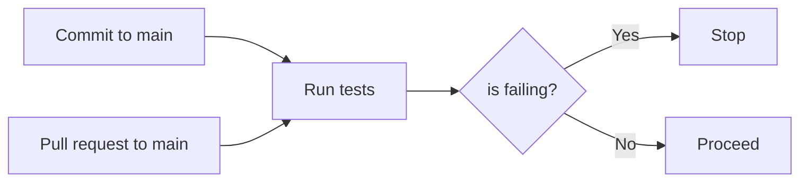

# PalletPals Client

The **PalletPals** client is written in [React](https://reactjs.org) and [Tailwind](https://tailwindcss.com) using the frontend tooling of [Vite](https://vitejs.dev).

## Getting Started

```bash
# install dependencies
npm install

# start dev environment
npm run dev

# build
npm run build

# run tests
npm run test
```

Use the reverse proxy [**p3**](./p3) in development.

## Workflow

### Feature-Checklist

The following checklist has to be fulfiled before a feature is completed.

- [ ] Localization is complete?
- [ ] Tests are written (at least 1 per feature)?
- [ ] Tests are passing (100%)?
- [ ] Implementation is congruent with specification ([UC, SD, CP](#terminology))?
  - [ ] If not, is specification updated?
- [ ] Works on mobile device?
- [ ] No dead imports or similar?

### Automated Testing

Tests are automatically run by a GitHub Action for every commit and pull request on the main branch. Merging is prevented if a test fails.



### Formatting

[Prettier](https://prettier.io) is used to format the codebase. Additionally, Tailwind classes are sorted using the official [Tailwind CSS Prettier plugin](https://github.com/tailwindlabs/prettier-plugin-tailwindcss).

## Testing

### Unit Tests

Unit tests are written using [Vitest](https://vitest.dev) and [Testing Library](https://testing-library.com). Tests for a component are written in a `ComponentName.test.jsx` file inside the components directory to keep the source code and tests close to each other.

### Automated Testing

Tests can be run locally with the `npm test` command. Additionally, Github Actions are used to automatically run all test suites. On every push on the main branch and on each pull request, this test workflow is run automatically. In the case of a failure, merging is blocked and the commit is marked as failing. This solves the issue of "forgetting" to run tests and sends a notification / email to the contributors in case of a failure.

## Docker Environment

The client can be run inside a [Docker](https://www.docker.com) container. This requires Docker to be installed on the host system. [Docker Compose](https://docs.docker.com/compose) is used to start and stop the container.

```bash
# build & serve on :8080 (detached mode)
docker-compose up -d

# stop serving
docker-compose down
```

## Terminology

| Abbreviation | Term                    |
| ------------ | ----------------------- |
| CP           | Communications Protocol |
| SD           | Sequence Diagram        |
| UC           | Use Case                |
